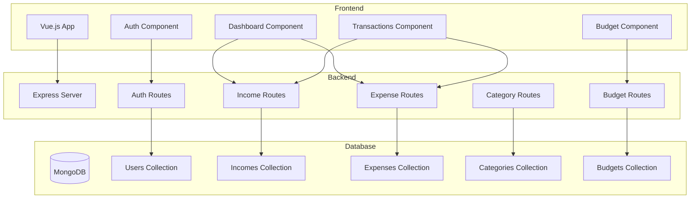

# Architektura systemu

## Architektura wysokiego poziomu

```
┌─────────────────┐
│   Przeglądarka  │
│    (Vue.js)     │
└────────┬────────┘
         │ HTTP/HTTPS
         │ (REST API)
         ▼
┌─────────────────┐
│  Backend API    │
│  (Express.js)   │
│                 │
│  - Routing      │
│  - Walidacja    │
│  - Logika biz.  │
└────────┬────────┘
         │ Mongoose ODM
         ▼
┌─────────────────┐
│    MongoDB      │
│   (NoSQL DB)    │
└─────────────────┘
```

## Warstwa kliencka (Frontend)

**Technologia:** Vue.js

**Odpowiedzialności:**
- Renderowanie interfejsu użytkownika
- Walidacja formularzy (po stronie klienta)
- Komunikacja z API (Axios)
- Zarządzanie stanem aplikacji
- Routing między widokami

**Lokalizacja:** `forntend/planer-frontend/`

## Warstwa API (Backend)

**Technologia:** Node.js + Express 5.2.1

**Odpowiedzialności:**
- Obsługa żądań HTTP (GET, POST, PUT, DELETE)
- Walidacja danych wejściowych
- Autentykacja użytkowników
- Logika biznesowa (obliczenia budżetowe, aktualizacje kaskadowe)
- Komunikacja z bazą danych

**Lokalizacja:** `backend/server.js`

### Endpointy API

#### Autentykacja
- `POST /api/register` - rejestracja nowego użytkownika
- `POST /api/login` - logowanie użytkownika

#### Dochody
- `POST /api/income` - dodawanie dochodu
- `GET /api/income?userId=X` - pobieranie dochodów użytkownika
- `PUT /api/income/:id` - edycja kwoty dochodu
- `DELETE /api/income/:id` - usuwanie dochodu

#### Wydatki
- `POST /api/expense` - dodawanie wydatku
- `GET /api/expense?userId=X` - pobieranie wydatków użytkownika
- `PUT /api/expense/:id` - edycja kwoty wydatku
- `DELETE /api/expense/:id` - usuwanie wydatku

#### Kategorie
- `GET /api/categories?userId=X&kind=income|expense` - lista kategorii
- `POST /api/categories` - dodawanie kategorii/podkategorii
- `PUT /api/categories/:id` - edycja nazwy (+ aktualizacja w transakcjach)
- `DELETE /api/categories/:id` - usuwanie kategorii (z zabezpieczeniem)

#### Budżet
- `GET /api/budget?userId=X&kind=X&month=X&year=X` - budżety z rzeczywistością
- `POST /api/budget` - tworzenie budżetu
- `PUT /api/budget/:id` - aktualizacja planowanej kwoty
- `DELETE /api/budget/:id` - usuwanie budżetu

## Warstwa danych (Database)

**Technologia:** MongoDB + Mongoose 9.1.1

**Kolekcje:**
- `users` - użytkownicy
- `incomes` - dochody
- `expenses` - wydatki
- `categories` - kategorie
- `budgets` - budżety

### Modele danych

#### User
```javascript
{
  email: String (unique, required),
  password: String (hashed, required),
  createdAt: Date (default: now)
}
```

#### Income
```javascript
{
  userId: ObjectId (required, indexed),
  amount: Number (required),
  category: String (required),
  subcategory: String (optional),
  createdAt: Date (default: now, indexed)
}
```

#### Expense
```javascript
{
  userId: ObjectId (required, indexed),
  amount: Number (required),
  category: String (required),
  subcategory: String (optional),
  createdAt: Date (default: now, indexed)
}
```

#### Category
```javascript
{
  userId: ObjectId (required),
  kind: String ('income' | 'expense', required),
  name: String (required),
  parentId: ObjectId (nullable, dla podkategorii),
  createdAt: Date (default: now)
}
```

#### Budget
```javascript
{
  userId: ObjectId (required),
  kind: String ('income' | 'expense', required),
  category: String (required),
  subcategory: String (optional),
  month: Number (1-12, required),
  year: Number (required),
  plannedAmount: Number (required),
  createdAt: Date (default: now)
}
```

### Relacje
- User 1:N Income
- User 1:N Expense
- User 1:N Category
- User 1:N Budget
- Category 1:N Category (parent-child dla podkategorii)

## Przepływ danych - przykład dodawania wydatku

```
1. Użytkownik wypełnia formularz (Vue.js)
   ↓
2. Frontend wysyła POST /api/expense
   {userId, amount, category, subcategory, date}
   ↓
3. Express otrzymuje żądanie
   ↓
4. Walidacja danych (userId, amount, category wymagane)
   ↓
5. Tworzenie obiektu Expense (Mongoose model)
   ↓
6. Zapis do MongoDB (expense.save())
   ↓
7. MongoDB zwraca zapisany dokument
   ↓
8. Express zwraca response 201 + obiekt expense
   ↓
9. Frontend aktualizuje widok (lista wydatków)
```

## Przepływ - pobieranie budżetu z rzeczywistością

```
1. Frontend wysyła GET /api/budget?userId=X&kind=expense&month=1&year=2026
   ↓
2. Backend pobiera budżety z MongoDB (Budget.find())
   ↓
3. Dla każdego budżetu:
   a. Buduj filtr dla transakcji:
      - userId
      - category (z budżetu)
      - opcjonalnie subcategory
      - zakres dat (np. 2026-01-01 do 2026-01-31)
   b. Pobierz transakcje (Income/Expense.find(filter))
   c. Sumuj kwoty (transactions.reduce)
   d. Oblicz różnicę (plannedAmount - actualAmount)
   ↓
4. Backend zwraca budżety z:
   - plannedAmount
   - actualAmount
   - difference
   - transactionCount
   - transactions[]
   ↓
5. Frontend wyświetla porównanie plan vs. rzeczywistość
```

## Bezpieczeństwo

### Hashowanie haseł
- Algorytm: **bcrypt**
- Salt rounds: **10**
- Hasła nigdy nie są przechowywane w plain text
- Porównanie: `bcrypt.compare(plainPassword, hashedPassword)`

### Autentykacja
**Obecny stan:** Fake token (`FAKE_TOKEN-${userId}`)

**Docelowo - JWT:**
```javascript
// Generowanie tokenu
const token = jwt.sign(
  { userId: user._id, email: user.email },
  process.env.JWT_SECRET,
  { expiresIn: '24h' }
)

// Middleware weryfikujący
function authMiddleware(req, res, next) {
  const token = req.headers.authorization?.split(' ')[1]
  if (!token) return res.status(401).json({error: 'Brak tokenu'})
  
  try {
    const decoded = jwt.verify(token, process.env.JWT_SECRET)
    req.userId = decoded.userId
    next()
  } catch (err) {
    res.status(401).json({error: 'Nieprawidłowy token'})
  }
}
```

### CORS
- Skonfigurowany dla bezpiecznej komunikacji frontend-backend
- Kontrola dozwolonych origin

### Walidacja
- Walidacja po stronie serwera dla wszystkich endpointów
- Sprawdzanie wymaganych pól
- Walidacja typów danych
- Kody błędów HTTP (400, 401, 404, 409, 500)

## Skalowalność

### Pozioma
- Separacja frontend-backend umożliwia niezależne skalowanie
- MongoDB wspiera sharding dla dużych wolumenów danych
- Stateless API (po implementacji JWT) - łatwe load balancing

### Pionowa
- Możliwość dodania cache (Redis) dla często pobieranych danych
- Load balancing dla API (nginx, HAProxy)
- CDN dla statycznych zasobów frontendu
- Indeksy MongoDB na często używanych polach (userId, createdAt)

## Propozycje usprawnień architektury

### 1. Podział server.js na moduły

```
backend/
├── controllers/
│   ├── authController.js      # Logika rejestracji/logowania
│   ├── incomeController.js    # Logika dochodów
│   ├── expenseController.js   # Logika wydatków
│   ├── categoryController.js  # Logika kategorii
│   └── budgetController.js    # Logika budżetu
├── routes/
│   ├── auth.js                # Routing autentykacji
│   ├── income.js              # Routing dochodów
│   ├── expense.js             # Routing wydatków
│   ├── category.js            # Routing kategorii
│   └── budget.js              # Routing budżetu
├── middleware/
│   ├── auth.js                # Middleware JWT
│   ├── validation.js          # Walidacje
│   └── errorHandler.js        # Centralna obsługa błędów
├── models/                    # Modele Mongoose
├── utils/
│   └── logger.js              # Winston/Morgan
└── server.js                  # Entry point
```

### 2. Właściwa implementacja JWT

Zastąpić `fakeToken` prawdziwym JWT:
- Generowanie przy logowaniu
- Middleware autentykacji dla chronionych endpointów
- Refreshtoken dla wydłużenia sesji

### 3. Centralizacja obsługi błędów

```javascript
// middleware/errorHandler.js
function errorHandler(err, req, res, next) {
  console.error(err.stack)
  
  if (err.name === 'ValidationError') {
    return res.status(400).json({ error: err.message })
  }
  
  if (err.name === 'MongoError' && err.code === 11000) {
    return res.status(409).json({ error: 'Duplikat' })
  }
  
  res.status(500).json({ error: 'Błąd serwera' })
}
```

### 4. Logowanie

```javascript
// Winston dla logów aplikacji
// Morgan dla HTTP request logging
const winston = require('winston')
const morgan = require('morgan')
```

### 5. Testy

```javascript
// Jest dla testów jednostkowych
// Supertest dla testów API
describe('POST /api/expense', () => {
  it('should create expense', async () => {
    const res = await request(app)
      .post('/api/expense')
      .send({ userId, amount: 100, category: 'Jedzenie' })
    expect(res.status).toBe(201)
  })
})
```

### 6. Zmienne środowiskowe

Aktualizacja `.env`:
```env
DB_URI=mongodb://localhost:27017/planer
PORT=3000
JWT_SECRET=your_super_secret_key_here
JWT_EXPIRES_IN=24h
BCRYPT_ROUNDS=10
NODE_ENV=development
```

## Diagram komponentów (Mermaid)


